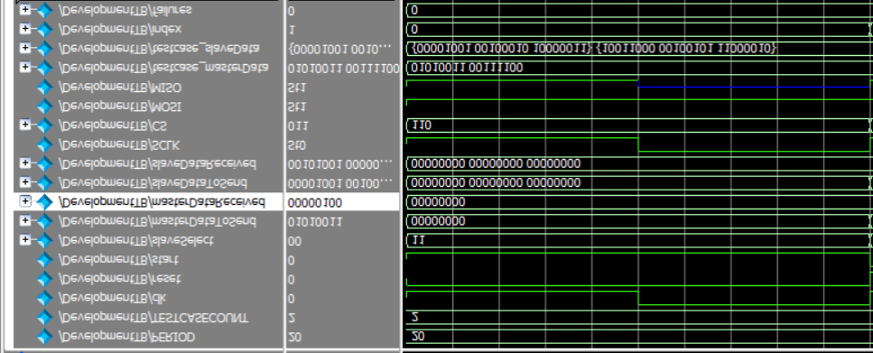
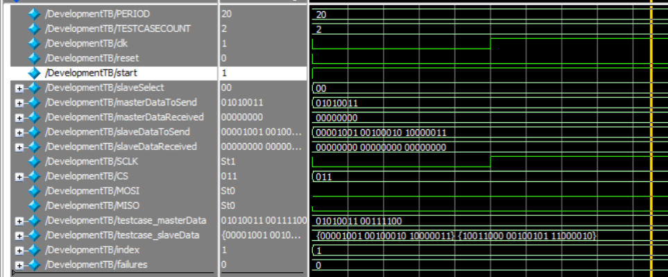
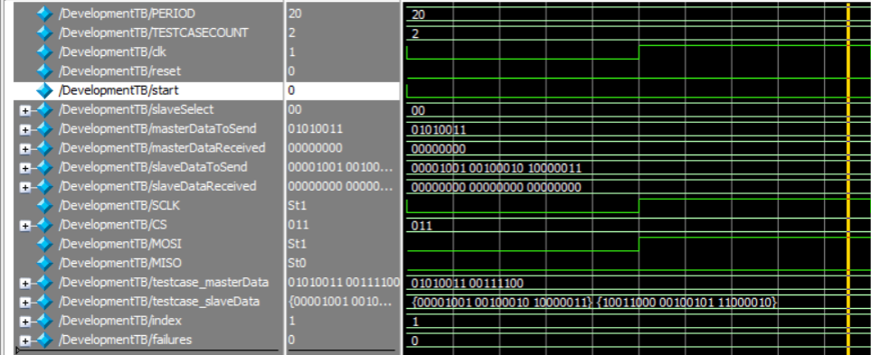
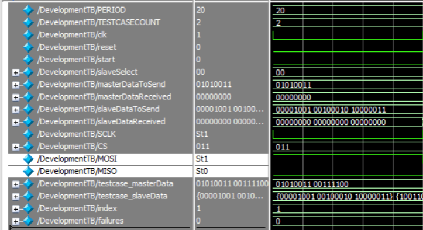
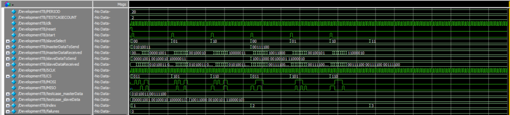
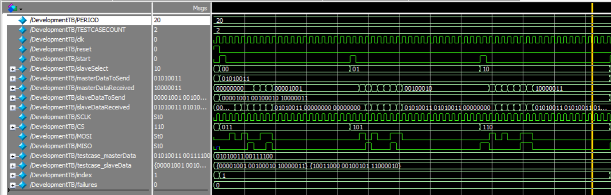
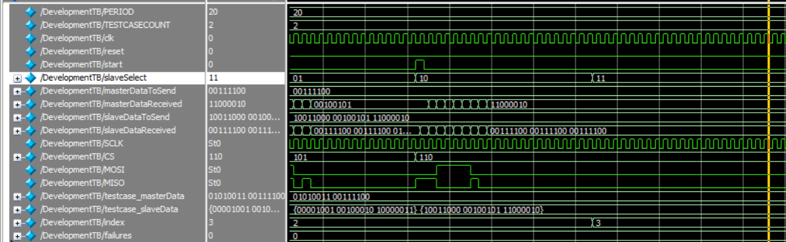

# __Serial Peripheral Interface__

## **Contributors**

| Abdelrahman Mohamed | Mohamed Nabil | Ziad Sherif | Ziad Tarek |
| :-----------------: | :-----------: | :---------: | :--------: |

## **Description**

* Serial peripheral interface: a synchronous serial communication interface that supports full-duplex mode where data
  can be sent and received simultaneously as shown in figure 1 as it is used to send data between microcontrollers and
  small peripherals such as shift registers, sensors, and SD cards. It uses separate clock and data lines, along with a
  select line to choose the device you wish to talk to.

## **Components**

* The SPI consists of one master and one slave or more in certain connection that determine the mainly mechanism of SPI.

## Master

### Inputs: -

* Clock
    * Will control the time of transmission data from the master to slave and vice versa as:
        * In the positive edge the master will send the data to slave by MOSI, and the slave also will send data to the
          master by MISO.
        * In the negative edge the master will read data from MISO and the slave will read data from the MOSI.

* Reset
    * Asynchronous reset (does not depend on clock).
    * Will reset data to initial given data.

* Start
    * Is signal that refers to start the communication between the master and the slave.

* SlaveSelect
    * Will decode this 2-bits signal to determine the slave will send and receive from the Master.

* MasterDataToSend
    * Initial given data to the master to start communication with it.

* MasterDataReceived
    * This wire will contain the data received by the master from the slaves.

* MISO
    * Contains the data sent from the slave to master.

### Outputs: -

* SCLK
    * Will send the clock data to the slaves to make the transmission synchronous.

* CS
    * The decoded data from slave select that determines the current slave will receive and send to the master.

* MOSI
    * Will contain the sent data to the selected slave.

## Slave

### Inputs: -

* Reset
    * Asynchronous reset (does not depend on clock).
    * Will reset data to initial given data.

* SlaveDataToSend
    * the initial data the slave will communicate with

* SCLK
    * The signal will control the communication as shown above.

* CS
    * Active low signal
    * The selected slave that will control :
        * If the slave will send the MISO
        * If the slave will read the MOSI

* MOSI
    * Will contain the send data to the slave.

### Outputs: -

* MISO
    * Contains the data sent from the slave to master.

* SlaveDataReceived
    * this wire will contain the data received by the slave from the master.

## Tracing the process

1. the start = 0 so the data in the master has not been read yet
   
2. the start = 1, the master read the data will communicate with and will start the process of transmission
   
3. the start should be zero again till the data will be transmitted totally not to make collision in transmission of
   data
   
4. In pos edge clock the MOSI and MISO will be assigned with data as explained before
   
5. In neg edge clock the master and the slave will read the data from MISO and MOSI respectively
   
6. after 8 clock cycles the MasterDataToSend will change totally by zeros and to start transmission again “start” should
   be 1
## Final Output
   
1. At index = 1
   
2. At index = 2
   
3. At index = 3
   